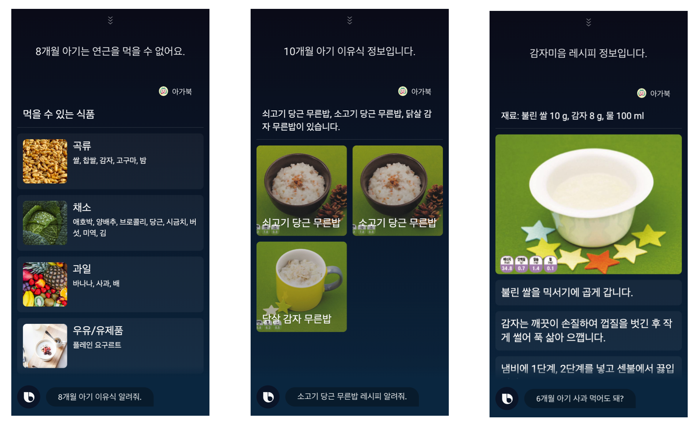
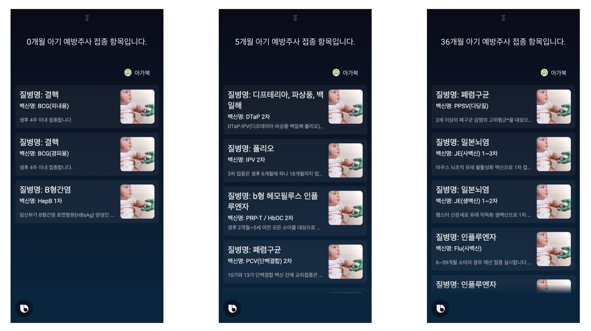
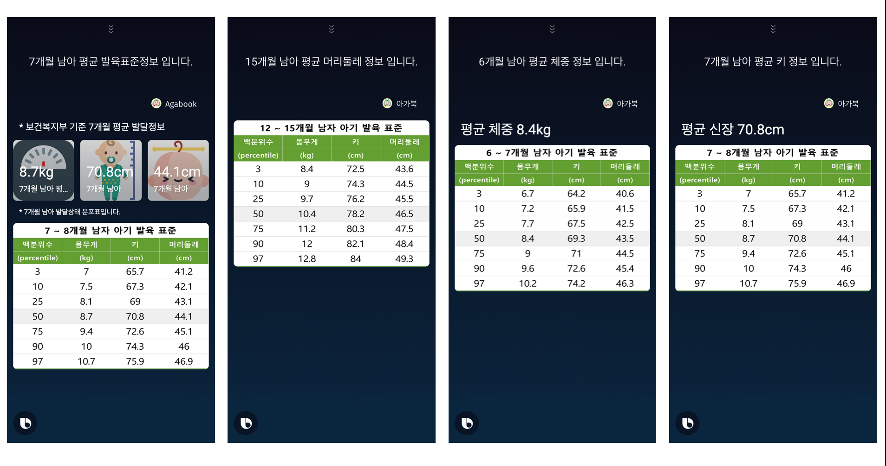

# 아가북

  
  

"작은 아이디어로 세상을 바꾸어보자! 육아 초보자를 위해 정보를 제공하는 빅스비 캡슐을 만든 아이디언즈 팀입니다."

## 대표 발화
> 이유식 정보

- 8개월 아기 연근 먹어도 돼?
- 감자미음 레시피 알려줘
- 7개월 아기 이유식 알려줘

> 예방주사 정보

- 36개월 아기가 맞아야할 예방주사는 뭐가있을까?
- 첫달 아기가 맞을 주사는 뭐야?
- 5개월 아기 예방접종 정보 보여줘

>발육표준 정보

- 6개월 남자 아기 평균 몸무게 알려줘
- 10개월 여자아기 평균 머리둘레는 어떻게돼?
- 7개월 남자아기 평균 키는 어떻게 될까
- 10개월 남자아기 표준발육은?

## 사용 예시
> 이유식

  

> 예방주사 정보

  

> 발육표준 정보

  

